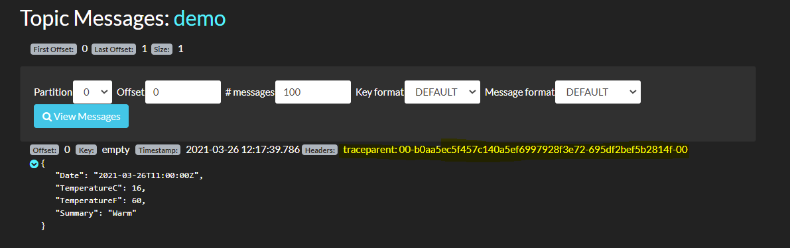
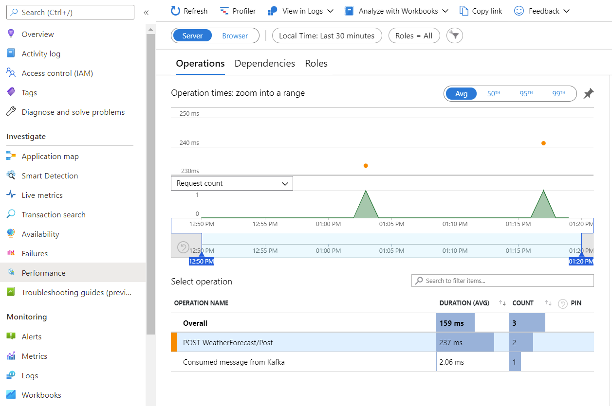
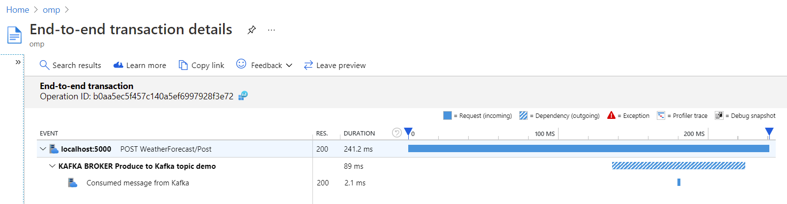
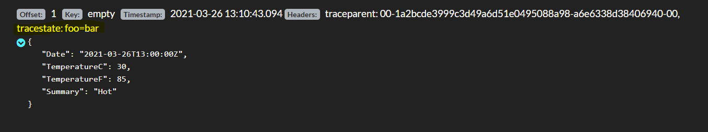
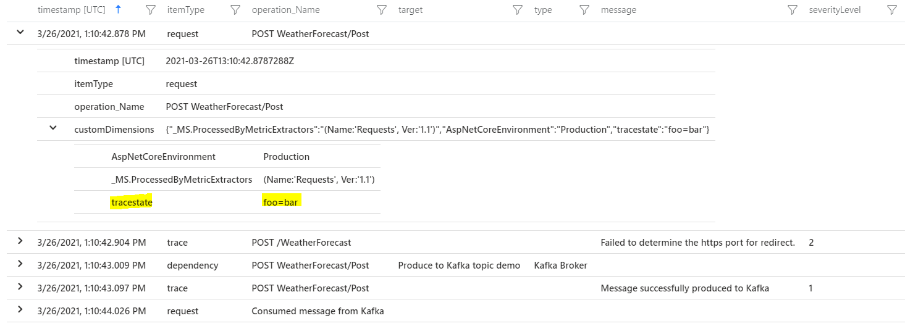

# Distributed Trace Context propagation code sample

Distributed tracing is a diagnostic technique that helps to localize failures and performance issues within applications, especially those built using a microservices architecture. A distributed trace traverses more than one component, so it is required to uniquely identify it across all systems. Trace context is a unique identifier for individual operations and it allows data to be linked together. There is a W3C specification for standardizing trace context (go to [the W3C Trace Context web page](https://www.w3.org/TR/trace-context/) to learn more about it).

This sample application is the ASP.NET Core web API. Request body from the POST API is sent to Kafka, and then it's consumed by a [KafkaConsumer](./TraceContextPropagationToKafka/Kafka/KafkaConsumer.cs). [Azure Application Insights](https://docs.microsoft.com/en-us/azure/azure-monitor/app/asp-net-core) is used to monitor the application. Azure Application Insights SDKs automatically track incoming HTTP requests and calls to dependent services, such as HTTP requests. However, there is a class of application patterns that can't be supported generically and manual code instrumentation is required. The sample code shows how to manually instrument Kafka dependency, how to propagate W3C compliant trace context to Kafka, and then how to extract it from Kafka messages. Thus end-to-end distributed tracing in the application can be achieved.

## Prerequisites

* A valid Application Insights connection string. It is required to send any telemetry to Application Insights. If you need to create a new Application Insights resource, follow [Create an Application Insights resource](https://docs.microsoft.com/en-us/azure/azure-monitor/app/create-new-resource). And check how to [find your connection string](https://docs.microsoft.com/en-us/azure/azure-monitor/app/sdk-connection-string?tabs=net#finding-my-connection-string).
* Docker installed
* .NET Core 5.0 SDK installed (only in case you do not want to use dockerized application)
* [curl](https://curl.se/) or any other tool for sending a POST request

## Setup

Sample application can be executed in two ways:

* Using docker-compose.
* Downloading source code and running it locally (e.g using Visual Studio) together with its dependencies.

### Using docker-compose

1. Clone this repository
2. Update [docker-compose.yaml](./docker-compose.yaml) by replacing `<ENTER_APPLICATION_INSIGHTS_CONNECTION_STRING>` with your Application Insights connection string
3. Start dependencies: Kafka, Zookeeper, and [Kafdrop - Kafka Web UI tool](https://github.com/obsidiandynamics/kafdrop#-kafdrop--kafka-web-ui--) for easy message browsing
```
docker-compose up zookeeper kafka kafdrop
```
4. Start the application
```
docker-compose up tracecontextpropagationtokafka
``` 

*Important*: Currently the application doesn't handle well Kafka topic creation. It requires the topic to be created before the [KafkaConsumer](./TraceContextPropagationToKafka/Kafka/KafkaConsumer.cs) is started. So as a workaround `tracecontextpropagationtokafka` container needs to be started *after* the `kafka` container is up and running. So make sure to follow steps 3 and 4 described above.

### Compile/debug locally

1. Clone or download the sample from this repository, then open the solution found in the root folder using your favorite IDE (this setup was tested with Visual Studio).
2. Specify your Application Insights connection string in [appsettings.json](./TraceContextPropagationToKafka/appsettings.json)
3. Start dependencies by using `docker-compose up kafka zookeeper kafdrop` (you can omit `kafdrop`, it's only used for viewing Kafka messages)
4. Start the application from your IDE

## Generate and view data

Once your application is running, send a POST request
```
curl -X POST "http://localhost:5000/WeatherForecast" -H  "Content-Type: application/json" -d "{\"date\":\"2021-03-26T09:05:00.000Z\",\"temperatureC\":16,\"summary\":\"Warm\"}"
```
Then you should receive `OK` response. Navigate to http://localhost:9000/topic/demo/messages (kafdrop tool) to view a message sent to Kafka. The message contains a [traceparent header](https://www.w3.org/TR/trace-context/#traceparent-header).


**Figure 1: Kafka message with traceparent header**

To view all operations that are related to this single POST request login to Azure Portal, then navigate to Application Insights that you connected with the application and open the [Performance panel](https://docs.microsoft.com/en-us/azure/azure-monitor/learn/tutorial-performance#identify-slow-server-operations). Under the Operations tab, you will see `POST WeatherForecast/Post`. Once you click on it, you can select a sample operation and view End-to-end transaction details.


**Figure 1: Application Insights performance overview**


**Figure 1: Application Insights E2E transaction details**

If you want to see this data in logs, get an `operation_Id` of the operation. It is visible in End-to-end transaction details or you can take it from traceparent header ([check how it's mapped to `operation_Id`](https://docs.microsoft.com/en-us/azure/azure-monitor/app/correlation#correlation-headers-using-w3c-tracecontext)). Then use the following query:
```
union *
| where operation_Id == "_your-operation-id_"
| project timestamp, itemType, operation_Name, target, type, message, severityLevel, customDimensions
```

If you want to see a [tracestate](https://www.w3.org/TR/trace-context/#tracestate-header) propagation, then send it as a header ([it is required to send traceparent header too](https://www.w3.org/TR/trace-context/#no-traceparent-received))
```
curl -X POST "http://localhost:5000/WeatherForecast" -H  "Content-Type: application/json" -H "tracestate: foo=bar" -H "traceparent: 00-1a2bcde3999c3d49a6d51e0495088a98-ab12c12345bbe300-00" -d "{\"date\":\"2021-03-26T13:00:00.000Z\",\"temperatureC\":30,\"summary\":\"Hot\"}"
```

You should see that `tracestate` header is propagated to Kafka and it's added to `customDimensions` in Application Insights logs.


**Figure 1: Kafka message with tracestate header**


**Figure 1: Logs with tracestate header**